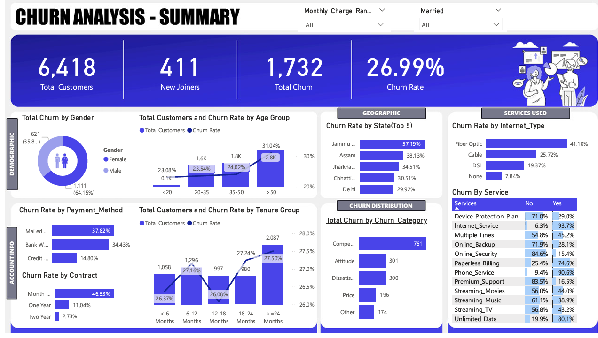

# 📊 Telecom Churn Analysis Dashboard

This project presents a **Telecom Churn Analysis Dashboard** developed using **Power BI** with **MySQL** as the backend data source. The goal is to identify customer churn patterns and key insights to help telecom businesses take proactive retention measures.

---

## 🎯 Objective

To analyze customer behavior and churn trends by leveraging demographic, service usage, and account-related data. The dashboard helps:

- Identify high-risk customers likely to churn  
- Highlight churn drivers by gender, age, geography, contract type, etc.  
- Support business strategies for customer retention and revenue optimization  

---

## 🛠️ Tools Used

- **Database**: MySQL  
- **Visualization**: Power BI  
- **Language**: SQL  

---

## 📈 Dashboard Features

The dashboard provides interactive visualizations with filters and slicers for deeper exploration:

### 🔹 Summary KPIs
- **Total Customers**: 6,418  
- **New Joiners**: 411  
- **Total Churn**: 1,732  
- **Churn Rate**: 26.99%  

### 🔹 Demographic Insights
- **Churn by Gender**: Higher among males (64.15%)  
- **Churn by Age Group**: Highest in age >50 (31.04%)  

### 🔹 Geographic Distribution
- **Top States by Churn Rate**:
  - Jammu & Kashmir: 57.19%
  - Assam, Jharkhand, Chhattisgarh, Delhi follow

### 🔹 Account & Service Analysis
- **Contract Type**: Month-to-month contracts show the highest churn (46.53%)  
- **Payment Method**: Mailed check users have the highest churn (37.82%)  
- **Internet Type**: Fiber optic users show highest churn (41.10%)  
- **Service Usage Patterns**:  
  - 90.6% churners had Phone Service  
  - 93.7% had Internet Service  
  - Churners often did not opt for premium support or security services

### 🔹 Churn Categories
- **Top Reasons**:
  - Competitor Influence
  - Attitude of Service Staff
  - Dissatisfaction with Services

---

## 📷 Dashboard Snapshot

---

## 💡 Key Business Insights

- 📉 **Short-term Contracts → Higher Churn**: Customers with month-to-month contracts are more likely to leave.
- 🔐 **Value of Bundled Services**: Lack of additional services (like Premium Support, Device Protection) correlates with higher churn.
- 📍 **Location-Specific Strategy**: Some regions like Jammu & Kashmir show unusually high churn rates — ideal for targeted campaigns.
- 🎯 **Target Senior Customers**: Age group >50 is most vulnerable to churn, indicating need for more engagement or personalized offerings.

---

## 📁 Project Structure

📦 telecom-churn-analysis  
├── 📁 mysql # Contains SQL queries and table schema  
├── 📄 Churn Analysis.pbix # Power BI dashboard file  
├── 📄 Churn Analysis.pdf # Exported dashboard as PDF  
├── 📄 Customer_Data.csv # Raw data used for analysis  
├── 📄 churn-analysis.png # Dashboard screenshot  
└── 📄 README.md # Project documentation  

## 💡 Key Insights

- 📉 Short-term contracts lead to significantly higher churn
- 📍 Specific states like Jammu & Kashmir require churn-focused strategies
- 💼 Users with fewer additional services (e.g., online backup, protection) tend to churn more
- 👥 Elderly customers (>50 years) are the most likely to churn — potential for personalized plans

---

## 👤 Author

**Bhavesh Kalihari**  
📎 [GitHub](https://github.com/STAAR13)

